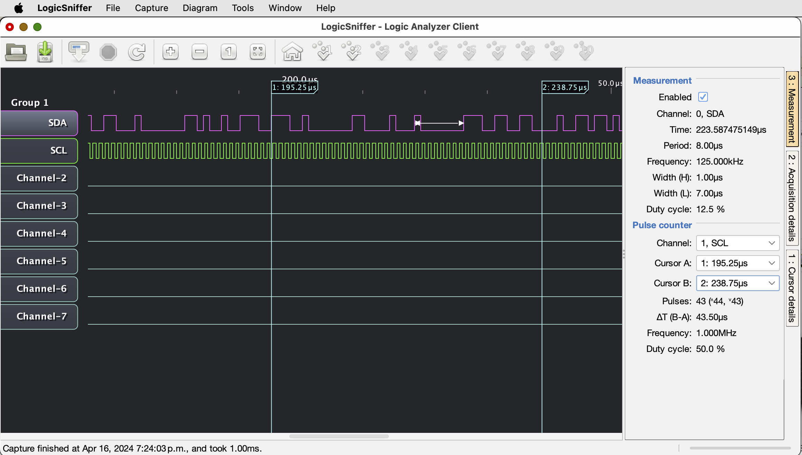
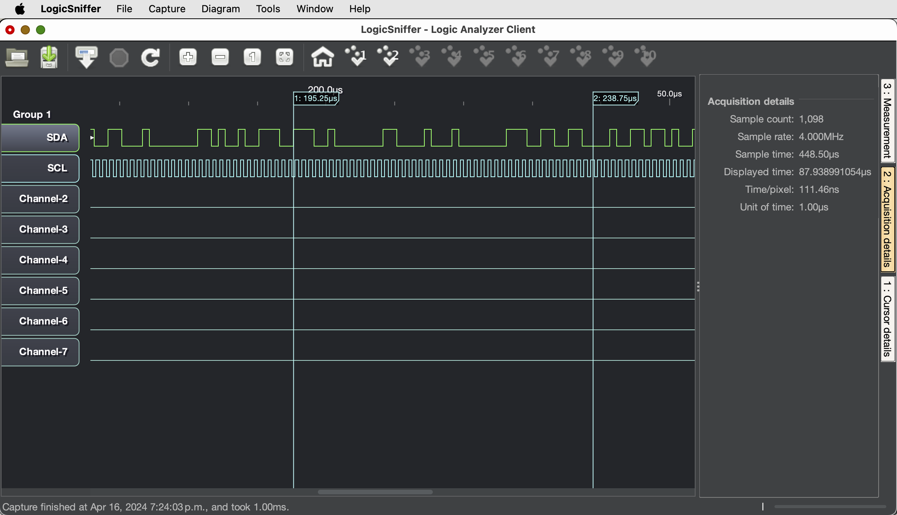
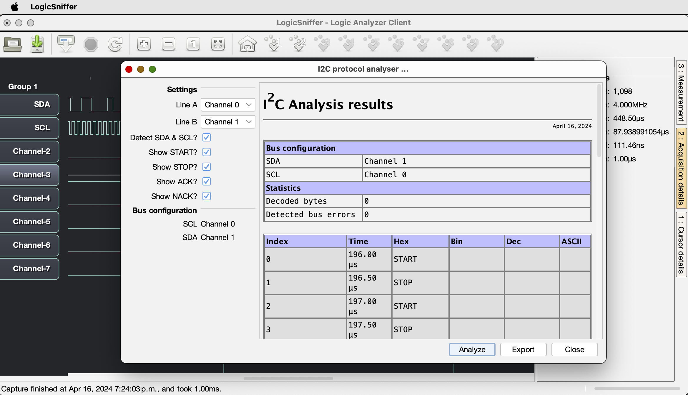
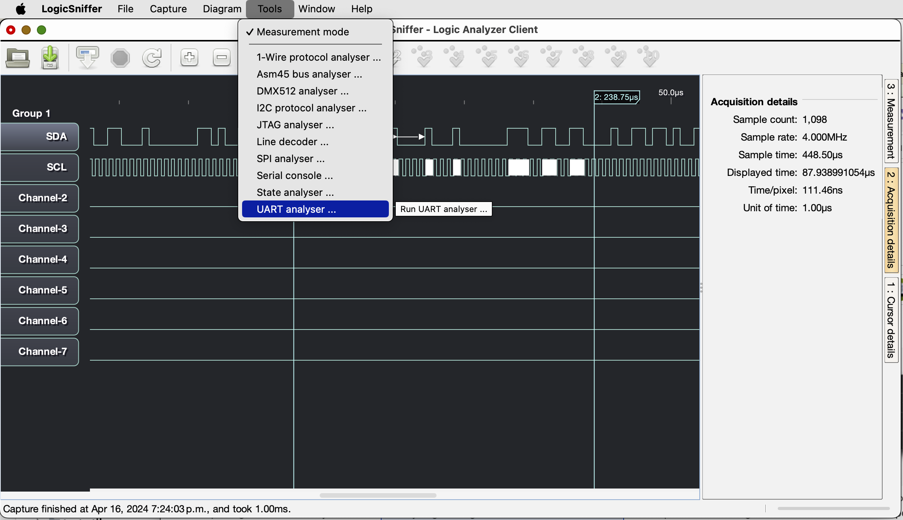
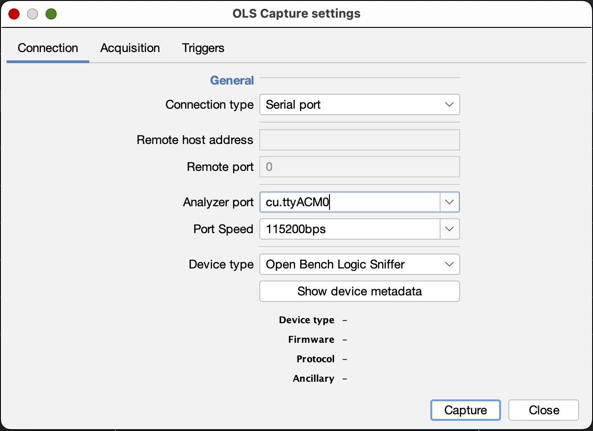
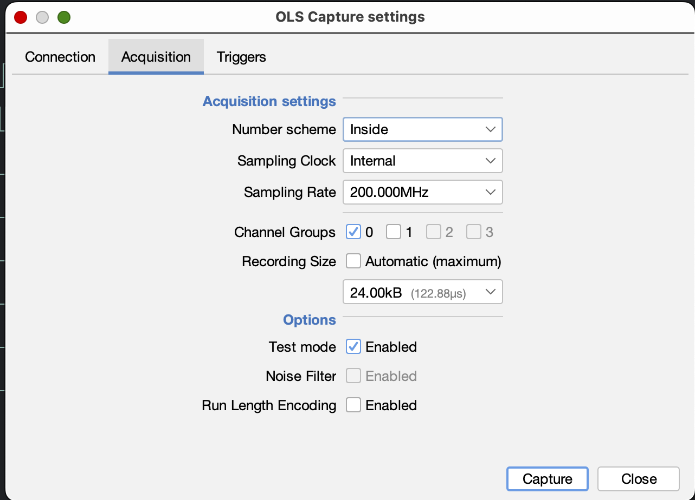
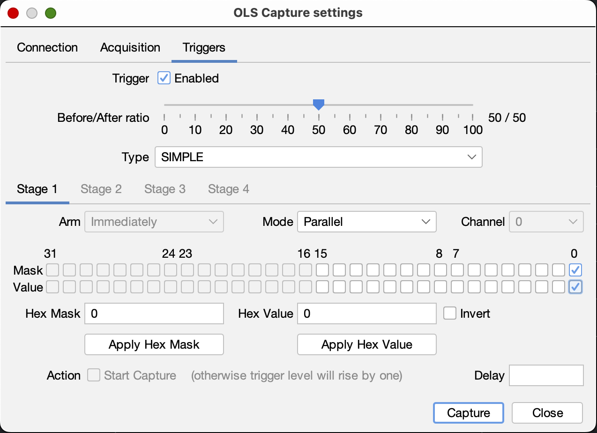
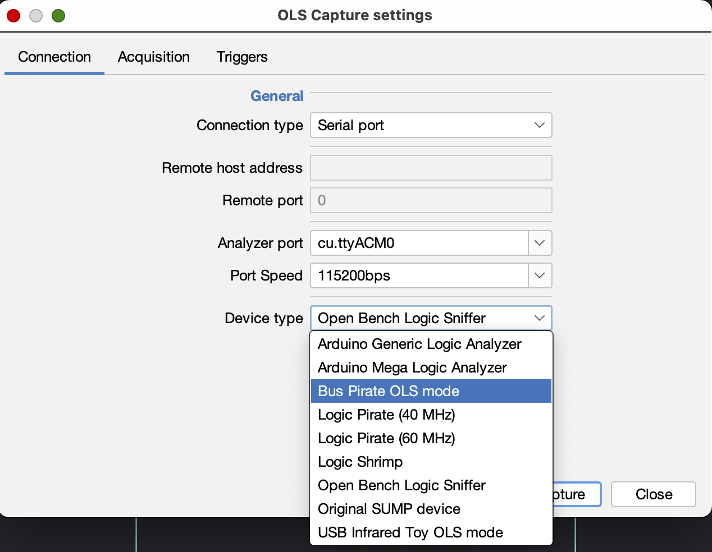
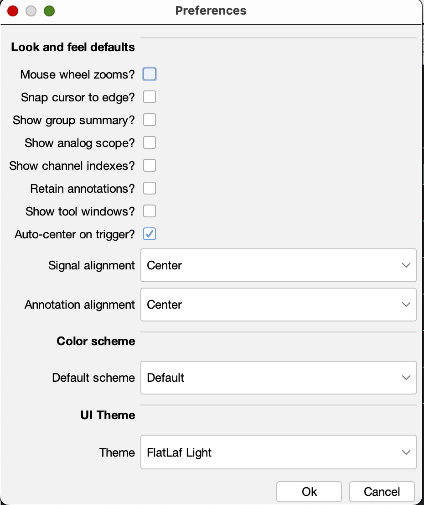
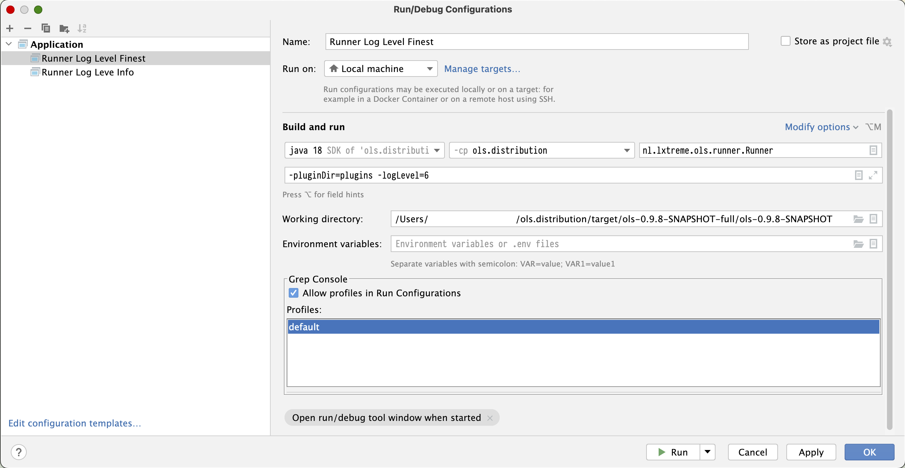

[](https://github.com/fbarriga/ols/actions)
[](https://github.com/fbarriga/ols/actions/workflows/release.yml?query=workflow%3A%22Create+Release%22)
[](https://github.com/fbarriga/ols/blob/main/LICENSE)
[](https://github.com/fbarriga/ols/graphs/contributors/)
[](https://github.com/fbarriga/ols/issues/)
[](https://github.com/fbarriga/ols/pulls/)

[](https://github.com/fbarriga/ols/watchers/)
[](https://github.com/fbarriga/ols/network/)
[](https://github.com/fbarriga/ols/stargazers/)

# OpenBench LogicSniffer

OpenBench LogicSniffer (*ols*) is a cross-platform, GUI Java client 
for [Open Bench Logic Sniffer] but supports other devices.

This repository has been forked from [jawi/ols].

This fork's goal is to update the client just enough to make it work on modern systems.

## SUPPORTED PLATFORMS

### Tested

- MacOS Sonoma 14.3 - Silicon / OpenJDK 18
- MacOS Ventura 13.6 - Intel / OpenJDK 19
- Fedora 34 - x86_64 / OpenJDK 18 / X.Org 1.20.14
- Windows 11 64-bit x86 / JDK 22

### Not tested

- Solaris
- FreeBSD
- OpenBSD

## SUPPORTED DEVICES

### Tested

- [Open Bench Logic Sniffer]
- [BusPirate]

### Not tested

- Original SUMP device
- [LogicPirate] (both 40 and 60MHz variants)
- [LogicShrimp]
- [USB IRToy]
- [Arduino + Arduino Mega Logic Analyser]
- [Pipistrello] (serial-based only).

## SCREENSHOTS
[](docs/screenshots/main_measurements.png)
[](docs/screenshots/main_acquisition_details_darcula.png)
[](docs/screenshots/i2c_analysis.png)
[](docs/screenshots/available_tools.png)

[](docs/screenshots/capture_settings_connection.png)
[](docs/screenshots/capture_settings_acquisition.png)
[](docs/screenshots/capture_settings_triggers.png)
[](docs/screenshots/capture_settings_devices.png)
[](docs/screenshots/preferences.png)

## LINKS

To access documentation (bearing in mind it may be outdated), please refer to the following links:
- https://lxtreme.nl/projects/ols/
- https://github.com/jawi/ols
- https://github.com/jawi/ols/blob/master/README.md
- https://github.com/jawi/ols/wiki


## COMPILING THE SOURCES

### Prerequisites

- JDK 17+
- Maven 3.9.x

### Compiling

```shell
$ cd ols
$ mvn clean install package
```

After this, you should find the latest binary ZIP and tarball in
`ols.distribution/target`.

### Compiling on MacOS

```shell
$ brew install maven
$ cd ols
$ export createDMG=1
$ mvn clean install package
```

After this, you should find the latest binary ZIP, tarball, DMG and .app in
`ols.distribution/target`.


## DEVELOPMENT

### Setup IntelliJ IDEA

[](docs/intellij.png)


## LICENSE

[](https://www.gnu.org/licenses/gpl-2.0.html)

    This program is free software; you can redistribute it and/or
    modify it under the terms of the GNU General Public License
    as published by the Free Software Foundation; either version 2
    of the License, or (at your option) any later version.

    This program is distributed in the hope that it will be useful,
    but WITHOUT ANY WARRANTY; without even the implied warranty of
    MERCHANTABILITY or FITNESS FOR A PARTICULAR PURPOSE.  See the
    GNU General Public License for more details.

    You should have received a copy of the GNU General Public License
    along with this program.  If not, see <http://www.gnu.org/licenses/>.


[jawi/ols]: https://github.com/jawi/ols
[Open Bench Logic Sniffer]: http://dangerousprototypes.com/docs/Open_Bench_Logic_Sniffer
[BusPirate]: http://dangerousprototypes.com/docs/Bus_Pirate
[LogicPirate]: http://dangerousprototypes.com/docs/Logic_Pirate
[LogicShrimp]: http://dangerousprototypes.com/docs/Logic_Shrimp_logic_analyzer
[USB IRToy]: http://dangerousprototypes.com/docs/USB_Infrared_Toy
[Arduino + Arduino Mega Logic Analyser]: https://github.com/gillham/logic_analyzer
[Pipistrello]: https://web.archive.org/web/20231207021513/pipistrello.saanlima.com/index.php?title=Welcome_to_Pipistrello
